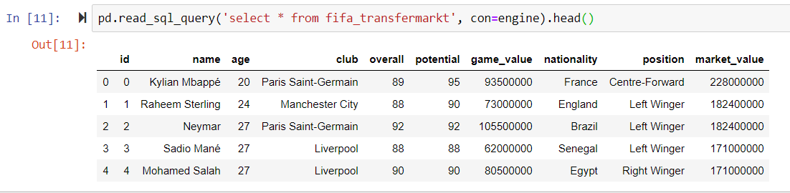

# ETL Brief

Project name: ETL
Team: Joao Costa, Kate Vnuk

## Purpose of this Document:

This document is intended to provide Instructors with an overview of the Soccer TMS and players ratings. 
An integral part of this project  is to pull, clean and merge the multiple databases for FIFA in order to learn on how we can manipulate with the data and clean it using the following tools:

### Tools:
* Jupyter
* PgAdmin
* Datasets
* Pandas

### Scope:

We decided to pull the data for the game Fifa 20 and international Transfer Market Values in order to compare a few data sets for the game and the real world, like costs and players rating.

The years we are looking at are the 2019-2020.

It also outlines the strategies and technologies and datasets used as part of the overall ETL project.

### Project Plan:

1.	Find data for real world transfer market value for the players and data for the game FIFA 20.
2.	Add/merge the market value of the players to the game dataset above (choose top 25).
3.	Compare the value on the game with the real world transfer market values.
4.	To identify if the game values are matching or affecting anyhow the real world values.

Datasets:
* FIFA 2020 (csv)  https://www.kaggle.com/stefanoleone992/fifa-20-complete-player-dataset
* Transfermarkt (scrape): https://www.transfermarkt.co.uk/

## PRACTICAL PART

### METHODS DESCRIPTION:
 
 
Using the ETL processes, the following tasks were done:
 
### Extract:

1)	Scrape real world transfer market value.
2)	Download the FIFA 20 game stats.

  Source:

* FIFA 2020 (csv)  https://www.kaggle.com/stefanoleone992/fifa-20-complete-player-dataset
* Transfermarkt (scrape): https://www.transfermarkt.co.uk/

        	 
### Transform:

1 - Clean Data   
a) Used Python Pandas library to load and read the .csv files. 
b) Remove unnecessary columns from the dataset. 
 
2 - Merged tables  
a) Used fuzzywuzzy library for strings comparison purpose, returning the scores for the matching % of the strings in the dataset. 

b) Results were saved as DataFrame. 
c) Used Python pandas library to convert lists to DataFrame and export it to a csv file. 
d) Convert the player Market Value from string into integer in order to proceed with data analysis using seaborn plotting. 

3 - Build plots  
a. The following plots were build using seaborn library: 
 * Preferred players position
 * Market Value vs 1 game value
 * Correlation
 * Regression
 * Potential vs Market Value
 * Market value of players per nation for the top 30 nations
 * Average Rating by Nationality
 * Potential for the top 25 Players 
 
 b. Here are some of the plots:  
 
 
 
 
 
 
### Load:

1) Created SQL connection  
2) Exported to PostgreSQL. Since the final output is a DataFrame, we decided to load the data into a relational database.
3) The final database column are as following: 
 * id INT PRIMARY KEY,
 * name Text,
 * age INT,
 * club Text,
 * overall INT,
 * potential INT,
 * game_value INT,
 * nationality Text,
 * positionText,
 * market_value INT

## LINKS

The whole process is documented in Jupyter Notebooks and SQL files in the link below:

[https://github.com/katevnuk/ETL/tree/master/ELT_project](https://github.com/katevnuk/ETL/tree/master/ELT_project)

